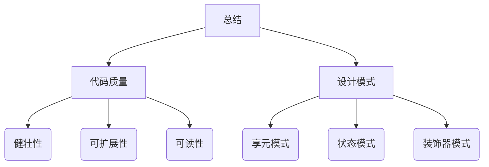

# 1 评价代码质量指标


## 1.1 健壮性
程序的健壮性是指程序在执行时，在局部发生错误的情况下，不影响整个系统的运行，而且我们能够很快的定位到发生错误的位置。我们通常使用以下几种方式来保证程序的健壮性。

### 1.1.1  参数校验
请看下面的代码：
```
function add(a, b) {
	return a + b;
}

function handler(num) {
	//一系列复杂操作......
	return num + 6;
}

//调用
var num = add(1);
var result = handler(num)
console.log(result); //NaN

```
在上边的代码中我们调用handler进行运算时没有得到正确的结果，我们的第一反应 肯定是handler中出现错误了，但是事实上是因为我们调用函数a()的时候少传了一个参数，导致的错误。这导致我们找bug很慢，所以，函数a()是不健壮的。我们可以修改代码如下：
```
function add(a, b) {
	if (typeof a === 'number' && typeof b === 'number') {
		return a + b;
	} else {
		throw new Error('a or b is not a number');
	}
}

function handler(num) {
	var _arr = [1, 2, 3, 4, 5, 6];
	return _arr[num] + 6;
}

//调用
var num = add(1);
var result = handler(num)
console.log(result); //NaN

```
上边是对基本类型的参数进行参数校验，那么我们如何对对象类型的参数进行校验呢？答案是选项合并，这种方式在vue，webpack，react中也经常被用到。请看下面的代码：
```
//对对象参数校验，选项合并
function Vue(config) {
	var _default = {
		a: 1,
		b: 2
	}
	for (var item in config) {
		_default[item] = config[item] || _default[item]
	}
}

var vueob = new Vue({
	a: 1,
	b: 2
});

//调用
var num = add(1);
var result = handler(num)
console.log(result); //NaN

```
类的校验：
```
//Vue类
function Vue(config) {
	var _default = {
		a: 1,
		b: 2
	}
	for (var item in config) {
		_default[item] = config[item] || _default[item]
	}
}
//对象参数校验
var vueob = new Vue({
	a: 1,
	b: 2
});

//校验类
function myVue(vueob) {
	if (vueob instanceof Vue) {
		//一系列操作
		console.info("微信公众号AlbertYang");
	} else {
		throw new Error('vueob is not a instanceof vue');
	}
}
```

### 1.1.2 try, catch

try ,catch一般是在预计某段代码可能会出错（比如浏览器兼容问题，）时，就可以把这段代码放入try内，然后当出现错误时就会自动去执行catch里的代码。比如读取文件的时候可能会发生文件找不到错误，这时候我们就可以把文件读取操作，放到try ,catch中。
```
//用户输入一个文件，我们去读取
//可能会发生文件找不到错误
try {
	fs.readFile();//可能会发生错误
} catch (e) { //捕获发生的错误
	//处理错误并执行
} finally {
	//无论try catch结果如何，finally里面的代码一定执行
}

```

### 1.1.3 控制变量权限
有时候我们希望一个变量，只能被读，不能被修改，我们该如何做呢，答案是使用
Object.defineProperty() 方法，它可以直接在一个对象上定义一个新属性，或者修改一个对象的现有属性， 并返回这个对象。请看下面的代码：
```
var person = {};
Object.defineProperty(person, "name", {
	writable: false,
	value: "张三"
});

console.log(person.name); // 张三
person.name = "李四";
console.log(person.name); // 张三

```

## 1.2 可扩展性
可扩展性是指当需要为程序添加新的功能时，对其他模块的影响和添加的代价很小，可以从下面几个方面提高程序的可扩展性。
### 1.2.1 模块分明
请看下面的代码：
```
function calc(a) {
	a += 10;
	a -= 2;
	a *= 3;
	a /= 2;
	return a;
}

```
上边的代码可扩展性不好，比如我们要改需求，在a+=10；和a-=2;之间添加a%=10,就得先去找代码在哪，然后再改代码,修改之后还会影响原来的代码。所以我们可以把每个操作都变成一个模块，这样你要加入一个操作就会非常容易，而且不影响其他模块。修改代码如下：
```
function calc(a) {
	a = handleAdd(a);
	a = handleFetch(a);
	a = handleDecrease(a)
	a = handleMultiply(a)
	a = handleEliminate(a)
	return a;
}

function handleAdd(a) {
	return a += 10;
}

function handleDecrease(a) {
	return a -= 2;
}

function handleMultiply(a) {
	return a *= 3;
}

function handleEliminate(a) {
	return a /= 2;
}

function handleFetch(a) {
	return a %= 8;
}
```
变成上边的代码后，我们再进行添加新的模块会非常方便，而且不影响原来的模块，后期维护代码的时候也会更加轻松。虽然这种方式，没有一开始那种方式代码量少，写代码的时间也会更长，但我认为这是值得的，因为后期维护的时候会为我们节省更多的时间。如果你维护过一些老的代码，你就会明白，易于维护的代码是多么的重要。


### 1.2.2 高内聚低耦合

耦合就是多个模块之间的依赖关系，而低耦合指的就是多个模块之间的依赖要尽可能的低。耦合度越低，那么意味着对其他模块依赖度越低，尽量在其他模块出问题的时候，自己开发的模块不会出问题，少依赖别人。一般降低耦合度常用的方法是加层数。
实例代码：

```
var data = [];

function a() {
	data.forEach(() => {})
}
```
data和函数a之间耦合度较高，可以加一个参数降低耦合度
```
var data = [];

function a(data) {
	data.forEach(() => {})
}
```
通过API接口传递消息也能降低耦合度：
```
function A(number) {
	this.number = number;
}
A.prototype.getNumber = function() {
	return this.number;
}

var a = new A(10);
function B() {
	a.getNumber();
}
```

除此之外一些设计模式，也可以帮我们降低代码的耦合度，如观察者模式，命令模式等。

### 1.2.3 用添加代替更改
当需求改变的时候，我们最好加上一段代码去实现新加的功能，而不是去改变原来的代码。

## 1.3可读性
 ### 1.3.1 变量命名规范
js命名应遵循 简洁、语义化 的原则
**变量命名方法**: 小驼峰式命名法，前缀为形容词 （函数前缀为动词, 以此来区分函数和变量）。
```
//好的命名方式
let maxCount = 10;
let tableTitle = '啦啦啦';
//不好的命名方式
let setConut = 10;
let getTitle = '啦啦啦';
```
**常量命名方法**：名词全部大写，使用大写字母和下划线来组合命名，下划线用来分割单词。
```
const MAX_COUNT = 10;
const URL = '//www.albertyy.com';
```
**函数 & 方法命名方法：** 小驼峰式命名法, 前缀应该为动词。
**常用动词约定：**
--------------------
|动词 |含义|返回值|
|---|---|---|
| can | 判断是否可执行某个动作 | 函数返回一个布尔值。true：可执行；false：不可执行|
|has | 判断是否含有某个值 | 函数返回一个布尔值。true：含有此值；false：不含有此值  |
|is | 判断是否为某个值 | 函数返回一个布尔值。true：为某个值；false：不为某个值  |
|get | 获取某个值 | 函数返回一个非布尔值  |
|set | 设置某个值 | 无返回值、返回是否设置成功或者返回链式对象  |
|load | 加载某些数据 | 无返回值或者返回是否加载完成的结果  |

```
// 是否可阅读
function canRead(): boolean { 
       return true;
}
// 获取名称
function getName(): string { 
    return this.name;
}
```
**类 & 构造函数命名方法**：大写驼峰式命名法，首字母大写，前缀为名称。
```
class Person {
	public name: string;
	constructor(name) {
		this.name = name;
	}
}
const person = new Person('albert');
```
**类的成员命名规范**：
1 公共属性和方法： 跟变量和函数命名一样。
2 私有属性和方法：前缀为下划线_, 后面跟公共属性和方法一样的命名方式。

```
class Person {
	private _name: string;
	constructor() {}

	// 公共方法
	getName() {
		return this._name;
	}
	// 公共方法
	setName(name) {
		this._name = name;
	}
}

const person = new Person();
person.setName('albert');
person.getName(); // ->albert

```
**注释规范**(格式化插件推荐prettier)
**行内注释** : 行内注释以两个斜线开始，以行尾结束。
语法：
```
code // 这是行内注释
//(双斜线)与代码之间保留一个空格，并且//(双斜线)与注释文字之间保留一个空格。
```
命名建议：
```
// 用来显示一个解释的评论
// -> 用来显示表达式的结果，
// >用来显示 console 的输出结果，
```
eg:
```
function test() { // 测试函数
	console.log('Hello World!'); // >Hello World!
	return 3 + 2; // ->5
}

```

**单行注释：**
单行注释以两个斜线开始，以行尾结束。
语法：
```
// 这是单行注释
单独一行：//(双斜线)与注释文字之间保留一个空格。
```
eg:
```
// 调用了一个函数；1)单独在一行
setTitle();
```
**多行注释**

以 /* 开头，*/ 结尾。
语法：
```
/* 注释说明 */
```
若开始/* 和 结束*/ 都在一行，推荐采用单行注释。若至少三行注释时，第一行为/* ，最后一行行为*/，其他行以 * 开始，并且注释文字与* 保留一个空格。
eg:
```
/*
 * 代码执行到这里后会调用setTitle()函数
 * setTitle()：设置title的值
 */
setTitle();
```
**函数 & 方法注释**
函数(方法)注释也是多行注释的一种，但是包含了特殊的注释要求，具体可以参照参照JSDoc。语法：
 
```
/** 
 * 函数说明 
 * @关键字 
 */
```
**常用注释关键字**：(只列出一部分)
|注释名| 语法| 含义| 示例|
|---|---|---|---|
|@param|@param 参数名 {参数类型} 描述信息|描述参数的信息|@param name {String} 传入名称|
|@return|@return {返回类型} 描述信息|描述返回值的信息|@return {Boolean} true:可执行;false:不可执行|
|@author|@author 作者信息 [附属信息：如邮箱、日期]|描述此函数作者的信息|@author 张三 2020/08/09|
|@version|@version XX.XX.XX|描述此函数的版本号|@version 1.0.3|
|@example|@example 示例代码|演示函数的使用|@example setTitle(‘测试’)|
eg:
```
/**
 * 合并Grid的行
 * @param grid {Ext.Grid.Panel} 需要合并的Grid
 * @param cols {Array} 需要合并列的Index(序号)数组；从0开始计数，序号也包含。
 * @param isAllSome {Boolean} ：是否2个tr的cols必须完成一样才能进行合并。true：完成一样；false(默认)：不完全一样
 * @return void
 * @author polk6 2015/07/21
 * @example
 * _________________                             _________________
 * |  年龄 |  姓名 |                             |  年龄 |  姓名 |
 * -----------------      mergeCells(grid,[0])   -----------------
 * |  18   |  张三 |              =>             |       |  张三 |
 * -----------------                             -  18   ---------
 * |  18   |  王五 |                             |       |  王五 |
 * -----------------                             -----------------
 */
function mergeCells(grid: Ext.Grid.Panel, cols: Number[], isAllSome: boolean = false) {
	// Do Something
}

```
 
这里只是详细讲解了 标识符命名规范 和 代码注释规范，由于篇幅有限，还有很多其它的规范没有些，大家可以可以参考一下[Airbnb JavaScript Style Guide](%3Ca href="https://github.com/AlbertYang666/javascript-1"%3Ehttps://github.com/AlbertYang666/javascript-1%3C/a%3E)。
 
### 1.3.2 代码结构清晰
清晰的代码结构，对于后期的维护非常重要，我们通常可以使用，分层和一些设计模式来使我们的代码结构更加清晰，在第二章中我将举一些设计模式的例子，来提高你的代码质量。

# 2 设计模式
设计模式（Design pattern）代表了最佳的实践，它是软件开发人员在软件开发过程中面临的一般问题的解决方案。这些解决方案是众多软件开发人员经过相当长的一段时间的试验和错误总结出来的。所以它对提高我们的代码质量真的很有用，我们要站在前人的肩膀上去写代码，设计模式我已经更新了一些，感兴趣的可以去看看。

## 2.1 用享元模式减少重复代码
当遇到类似的代码时，我们可以使用享元模式，提取它们不同的部分，减少代码量。
享元模式基本结构：


eg:
```
//extend函数,用于将一个或多个对象的内容合并到目标对象
$.extend = function() {
	if (arguments.length == 1) {
		for (var item in arguments[0]) {
			this[item] = arguments[0][item];
		}
	} else {
		for (var item in arguments[1]) {
			arguments[0][item] = arguments[1][item];
			return arguments[0];
		}
	}
}
```
使用享元模式提取不一样的部分：
```
$.extend = function() {
	var target = arguments[0];
	var source;
	if (arguments.length == 1) {
		target = this;
		source = arguments[0];
	} else {
		source = arguments[1];
	}
	for (var item in source) {
		target[item] = source[item];
	}
}
```
### 2.2 策略模式/状态模式
策略/状态模式的目的是为了优化if-else分支，当代码if-else分支过多时，可以考虑使用策略/状态模式。
**策略模式基本结构：**

**状态模式基本结构：**


**eg:** 
```
//移动div位置的方法
function mover() {
	if(arguments.length == 1){
		if(arguments[0] == 'left'){
			console.log('left');
		} esle if(arguments[0] == 'right'){
			console.log('right');
		} esle if(arguments[0] == 'top'){
			console.log('top');
		} esle if(arguments[0] == 'bottom'){
			console.log('bottom');
		}
	} esle {
		if(arguments[0] == 'left' && arguments[1] == 'right'){
			console.log('left');
			console.log('right');
		} esle if(arguments[0] == 'left' && arguments[1] == 'top'){
			console.log('left');
			console.log('top');
		} esle if(arguments[0] == 'left' && arguments[1] == 'bottom'){
			console.log('left');
			console.log('bottom');
		}....//更多代码省略
	}
}

```
上边的代码中有大量的if-else分支，我们使用状态模式优化上边的代码。
```
//移动div位置的方法
function mover() {
	this._status = [];
	this.actionHandle = {
		left: function() {
			console.log('left');
		},
		right: function() {
			console.log('right');
		},
		top: function() {
			console.log('top');
		},
		bottom: function() {
			console.log('bottom');
		}
	}
}

mover.prototype.run = function() {
	this._status = Array.prototype.slice.call(arguments);
	this._status.forEach((action) => {
		this.actionHandle[action]();
	})
}

new mover().run('left', 'bottom');

```
## 2.3 装饰器模式
装饰器模式模式动态地扩展了（装饰）一个对象的行为，同时又不改变其结构。装饰器模式的目的是为了扩展对象，所以当有一个方法需要去扩展，但又不好去修改原来的方法，可以使用装饰器模式。
装饰器模式结构：

**eg:**
```
//你进入一家新公司，接手了别人的代码
//doml，dom2，dom3绑定了onclick事件，产品经理说点击之后要增加新的效果
//这里我们使用装饰器模式，可以不用改原来的onclick方法,直接增加新的功能
function decortor(dom, fn) {
	if (typeof dom.onclick == 'function') {
		var _oldfn = dom.onclick;
		dom.onclick = function() {
			_oldfn();
			//加上你要增加的功能
			console.log("albert");
		}
	}
}

decortor(doml, function() {
	console.log("1");
})

decortor(dom2, function() {
	console.log("2");
})

decortor(dom3, function() {
	console.log("3");
})

```
在Vue数组的双向绑定中就用了这种模式。

# 3 总结
本文介绍了一些评价代码质量的指标：健壮性，可扩展性，可读性。同时举了一些使用设计模式（享元模式，策略、状态模式，装饰器模式）提高代码质量的例子。



今天的学习就到这里，你可以使用今天学习的技巧来改善一下你曾经的代码，如果想继续提高，欢迎关注我的微信公众号：AlbertYang，每天学习进步一点点，就是领先的开始。**如果觉得本文对你有帮助的话，欢迎点赞，评论，转发！！！**
